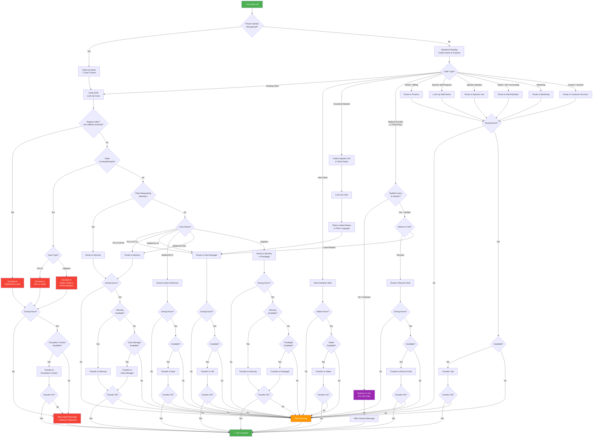

# McCraw Law Group - AI Receptionist Workflow Specification

**Prepared for:** McCraw Law Group Pilot Team
**Date:** January 29, 2026
**Purpose:** Validate our understanding of your call handling requirements

---

## How to Use This Document

This document describes exactly how your AI receptionist will handle incoming calls based on your SOPs. Please review each section and let us know if:
- Any workflow doesn't match your expectations
- You have answers to our open questions
- Any scenarios are missing

---

## Call Flow Overview

### Open Questions Highlighted in Flow

**⚠️ Availability Checking:** The diagram shows "Available?" checks before transfers. Your SOP says "Confirm that the staff member is available to take the call." How does your team currently check availability? (Teams status? Phone system? Calendar?)

**⚠️ Callback Preference:** For urgent/escalation messages, your Crisis SOP mentions offering: "A call back within 1–2 hours" or "A scheduled call for the following day." Should we collect this preference?

**⚠️ Repeat Caller Detection:** How do we know if someone is a repeat caller who hasn't received a callback? Do we have access to call history?

---

## 1. Universal Policies

*These apply to ALL calls regardless of caller type.*

### 1.1 Standard Greeting

**What happens:**
- AI receptionist answers: "McCraw Law Group, this is [Name]. How can I help you?"
- Collects caller's full name (first AND last)
- Identifies the reason for the call
- Routes to appropriate workflow

**Source:** SOP - Inbound Caller Intake and Routing Workflow, Page 1

---

### 1.2 Business Hours Handling

**During office hours:**
- Transfers are attempted to the appropriate staff member
- If transfer fails, take a detailed message

**Outside office hours:**
- Take a detailed message including:
  - Caller's full name
  - Callback number
  - Reason for call
  - Any case reference
- Promise follow-up on next business day

**Open Questions - Business Hours:**
1. What are your office hours? (7-day schedule needed)
2. Are intake hours different from general office hours?

---

### 1.3 Transfer Failures

**If a transfer doesn't connect:**
- Take a detailed message with all caller information
- Record the subject of the call
- Message will be sent to the staff member for follow-up

**Source:** SOP - Inbound Caller Intake and Routing Workflow, Page 2

---

### 1.4 Callback Number Collection

**What happens:**
- Always collect a callback number in case the call is disconnected

**Source:** SOP - Inbound Caller Intake and Routing Workflow, Page 1

---

### 1.5 Confidentiality

**What we DO NOT share over the phone:**
- We do not verify representation over the phone for third parties
- Third parties are directed to fax: 972-332-2361

**Source:** Intake Call Routing Cheat Sheet, Page 2

---

## 2. Caller-Type Workflows

### 2.1 Existing Clients (Pre-Litigation)

**How we identify:** Caller states they have an existing case, mentions their case manager or attorney, or asks about case status.

**Workflow:**
1. Collect caller's full name (first and last)
2. Verify identity by collecting date of birth
3. Look up their case in the system
4. Determine routing based on case status:

| Case Status | Route To |
|-------------|----------|
| Pre-Lit 00 - Under Consideration | Case Manager |
| Pre-Lit 01 - Process New Client Intake Forms | Case Manager |
| Pre-Lit 03 - Investigations | Case Manager |
| Pre-Lit 04 - Client Treating | Case Manager |
| Pre-Lit 05 - Record Retrieval | Case Manager |
| Pre-Lit 06 - Demand to be drafted | Case Manager |
| Pre-Lit 07 - Demand Issued awaiting response | Attorney |
| Pre-Lit 08 - Negotiations | Attorney |
| Pre-Lit 09 - Atty under review | Attorney |
| Pre-Lit 10 - Reject, Withdrawal, Refer out | Attorney |
| Pre-Lit 11 - Need to Transfer to Litigation | Attorney |

5. During hours: Transfer to case manager or attorney based on status
6. After hours: Take a message for callback

**What we can share:**
- Case manager name and contact information
- Confirmation that we have their file

**What requires human assistance:**
- Case status details (transferred to case manager/attorney)
- Legal questions
- Settlement information

**If caller asks to speak to attorney:**
- Transfer to attorney if available
- If attorney unavailable, transfer to case manager as fallback

**If transfer fails:** Take a detailed message for callback

**Source:** Intake Call Routing Cheat Sheet, Page 1

**Open Questions - Existing Clients (Pre-Lit):**
1. Should we verify identity with date of birth before discussing anything, or is name sufficient?
2. When routing to attorney (Pre-Lit 07-11), if attorney is unavailable, should we always try case manager next, or go straight to message?

---

### 2.2 Existing Clients (Litigation)

**How we identify:** Case lookup shows case is in litigation status.

**Workflow:**
1. Same identification process as Pre-Lit
2. Route to handling attorney or paralegal
3. If upset and neither available: escalate to Vickie Crabb or Emma Burgess

**Escalation contacts for Litigation:**
- Vickie Crabb
- Emma Burgess

**Source:** Intake Call Routing Cheat Sheet, Page 2

**Open Questions - Litigation Clients:**
1. How do we distinguish Pre-Lit from Litigation in the case system? Is there a specific field?
2. For Litigation cases, do we try attorney first, then paralegal, or either one?

---

### 2.3 Existing Clients (Settled Cases)

**How we identify:** Case lookup shows settled status.

**Workflow based on settlement stage:**

| Status | Route To |
|--------|----------|
| Settled 01 - 05 | Case Manager / Paralegal |
| Settled 06 - 07 | April VanHoose |
| Settled 08 - GAL - Minor Prove Up | Attorney assigned to case |

**Source:** Intake Call Routing Cheat Sheet, Page 1

**Open Questions - Settled Cases:**
1. What are the specific Settled 01-08 status descriptions? (We have the numbers but not what each stage means)

---

### 2.4 New Potential Clients (PNC)

**How we identify:** Caller mentions an accident, injury, needs a lawyer, asking about representation, or inquiring about case types handled.

**Workflow:**
1. Collect caller's full name
2. Transfer to Intake Team
3. If intake unavailable: Take a message with details

**Transfer destination:** Intake Team

**Source:** SOP - Inbound Caller Intake and Routing Workflow, Page 1

**Open Questions - New Clients:**
1. Is there a separate "Screening a Potential New Client (PNC)" SOP we should review?
2. Are intake hours different from general office hours?

---

### 2.5 Insurance Adjusters

**How we identify:** Caller identifies as insurance adjuster, claims representative, mentions insurance company name (GEICO, State Farm, etc.), asks about LOR/Letter of Representation, or mentions "on a recorded line."

**Workflow:**
1. Collect adjuster's name and company
2. Collect client/claimant name they're calling about
3. Look up the case
4. Share limited status information in plain language (not internal codes)
5. Transfer to case manager for detailed discussion

**What we can share:**
- Confirmation of representation (after case lookup)
- Case manager name and contact
- General case status in plain language

**What we DO NOT share:**
- Internal status codes
- Settlement amounts
- Medical details
- Legal strategy

**Transfer destination:** Case Manager

**Source:** Intake Call Routing Cheat Sheet, Page 1

**Open Questions - Insurance Adjusters:**
1. For cases in Pre-Lit 07-11 (attorney stages), should insurance adjusters still go to case manager, or to attorney?
2. Is any verification required before sharing case status or transferring? (e.g., confirm adjuster's name is on file, verify claim number, confirm they're calling from a known insurance company?) The SOP doesn't specify verification for insurance callers.

---

### 2.6 Medical Providers & Third Parties

**How we identify:** Caller identifies as hospital, clinic, medical provider, or third-party company calling about a patient/client.

**Workflow:**
1. Inform caller of our policy
2. Redirect to fax for all case-related inquiries:
   - "We are unable to verify representation or provide updates over the phone. We ask that you place an inquiry through our fax number: 972-332-2361."
3. Offer to take a general message if they have a non-case-related inquiry

**IMPORTANT - Blocked Entities:**
The following entities should ALWAYS be redirected to fax (never verify representation):
- Any hospital or ER room
- American Medical Response
- Optum
- Elevate Financial
- Rawlings
- Intellivo
- Medcap
- Movedocs
- Gain or Gain Servicing

**Exception - Verified Lienors:**
If a medical facility is listed in the lien tracking tab in SmartAdvocate, they may be transferred to case manager or record clerk depending on the nature of the call.

**Fax Number:** 972-332-2361

**Source:** Intake Call Routing Cheat Sheet, Page 2

**Open Questions - Medical Providers:**
1. How should we determine if a caller is a "verified lienor" vs. an unverified third party? Can this be looked up?
2. What types of calls from verified lienors go to the record clerk vs. case manager?
3. Who is the record clerk? (Name and contact needed)

---

### 2.7 Vendors / Billing Inquiries

**How we identify:** Caller mentions invoice, billing, payment, accounts payable, or identifies as a vendor.

**Workflow:**
1. Transfer to Finance/Accounting department

**Transfer destination:** Finance Department

**Source:** SOP - Inbound Caller Intake and Routing Workflow, Page 1

---

### 2.8 Direct Staff Requests

**How we identify:** Caller asks for a specific person by name.

**Workflow:**
1. Look up staff member by name
2. Transfer directly to that staff member
3. If unavailable: Take a message

**Source:** SOP - Inbound Caller Intake and Routing Workflow, Page 1-2

---

### 2.9 Administrative Calls

**How we identify:** Caller mentions HR, accounting, office management, or administrative matters.

**Workflow:**
1. Transfer to Administration team

**Transfer destination:** Administration

**Source:** SOP - Inbound Caller Intake and Routing Workflow, Page 1

**Open Questions - Administrative:**
1. Who handles administrative calls? (Phone number needed)

---

### 2.10 Marketing Calls

**How we identify:** Caller mentions marketing, advertising, or marketing-related inquiries.

**Workflow:**
1. Transfer to Marketing department

**Transfer destination:** Marketing

**Source:** SOP - Inbound Caller Intake and Routing Workflow, Page 1

**Open Questions - Marketing:**
1. Who handles marketing calls? (Phone number needed)

---

### 2.11 Spanish-Speaking Callers

**How we identify:** Caller speaks Spanish or requests Spanish assistance.

**Workflow:**
1. Transfer immediately to Spanish line

**Transfer destination:** Spanish Line

**Open Questions - Spanish:**
1. What is the Spanish line phone number?

---

### 2.12 General Help / Unclear Purpose

**How we identify:** Caller's purpose is unclear after asking, or they ask for general help (operator, receptionist, front desk).

**Workflow:**
1. Transfer to customer success / main reception for assistance

**Transfer destination:** Customer Success

---

## 3. Special Scenarios

### 3.1 Upset / Frustrated Clients

**How we identify:**
- Caller expresses frustration or anger
- Mentions repeated unsuccessful contact attempts
- Mentions no one has called them back
- Threatens to fire the firm or lodge complaints

**Pre-Litigation Escalation:**
If upset client and neither attorney nor case manager is available:
- Escalate to **Kyra** or **Janet**

**Litigation Escalation:**
If upset litigation client and neither attorney nor paralegal is available:
- Escalate to **Vickie Crabb** or **Emma Burgess**

**Crisis Response Principles (from your Crisis Management SOP):**
- Respond quickly
- Remain calm and professional
- Use active listening
- Offer realistic solutions when possible
- Escalate if issue exceeds receptionist authority

**Source:** Intake Call Routing Cheat Sheet, Pages 1-2; SOP - Client Crisis Management, Pages 1-2

**Open Questions - Upset Callers:**
1. What are Kyra and Janet's direct phone numbers?
2. What are Vickie Crabb and Emma Burgess's direct phone numbers?

---

### 3.2 Repeat Callers (No Callback Received)

**How we identify:** Caller mentions they've called before and haven't received a callback, or they're returning a call that wasn't returned.

**Workflow:**
1. Attempt to connect them directly with the intended staff member
2. If still unavailable: Escalate to department lead

**Source:** SOP - Inbound Caller Intake and Routing Workflow, Page 2

**Open Questions - Repeat Callers:**
1. Does this policy apply to all caller types or only existing clients?
2. Who are the department leads for:
   - Intake?
   - Case Management (Pre-Lit)?
   - Litigation?

---

### 3.3 Clients Calling Repeatedly (Escalation to Attorney)

**How we identify:** System shows client has called multiple times without receiving a callback.

**Workflow:**
- Contact the attorney to see if they can take the call

**Source:** Intake Call Routing Cheat Sheet, Page 1

**Open Questions - Repeat Callers:**
1. How many calls constitutes "repeatedly"? (2? 3? Within what timeframe?)
2. How should the AI receptionist know if a client has called repeatedly? (Do we have access to call history?)

---

### 3.4 Client Requests Attorney (When Unavailable)

**How we identify:** Existing client specifically asks to speak with their attorney.

**Workflow:**
1. Attempt to transfer to attorney
2. If attorney unavailable: Transfer to case manager instead
3. If case manager also unavailable: Take a message

**Source:** Intake Call Routing Cheat Sheet, Page 1

---

## 4. Information We Need From You

To configure the AI receptionist, we need the following:

### Required for Launch

| Item | Description | Status |
|------|-------------|--------|
| Office Hours | 7-day schedule (open/close times) | ⬜ Needed |
| Intake Hours | If different from office hours | ⬜ Needed |
| AI Receptionist Name | What name should the AI use? | ⬜ Needed |
| Timezone | For hours calculation | ⬜ Needed |

### Staff Directory

We need a complete staff list with:
- Full name
- Role (Attorney, Case Manager, Paralegal, etc.)
- Direct phone number or extension
- Email address

### Escalation Contacts (Direct Numbers Needed)

| Name | Role | Direct Number | Status |
|------|------|---------------|--------|
| Kyra | Pre-Lit Escalation | | ⬜ Needed |
| Janet | Pre-Lit Escalation | | ⬜ Needed |
| Vickie Crabb | Litigation Escalation | | ⬜ Needed |
| Emma Burgess | Litigation Escalation | | ⬜ Needed |
| April VanHoose | Settled 06-07 Specialist | | ⬜ Needed |
| Record Clerk | Medical Provider Inquiries | | ⬜ Needed |

### Department Phone Numbers

| Destination | Phone Number | Status |
|-------------|--------------|--------|
| Intake Team | | ⬜ Needed |
| Customer Success / General Escalation | | ⬜ Needed |
| Finance / Accounting | | ⬜ Needed |
| Administration | | ⬜ Needed |
| Marketing | | ⬜ Needed |
| Spanish Line | | ⬜ Needed |
| Fax | 972-332-2361 | ✅ Provided |

### SmartAdvocate Integration

| Item | Description | Status |
|------|-------------|--------|
| SmartAdvocate Instance URL | For case lookup integration | ⬜ Needed |
| API Access | Credentials for case lookup | ⬜ Needed |
| Case Status Field | To determine Pre-Lit vs Lit vs Settled | ⬜ Needed |
| Attorney Assignment Field | For status-based routing | ⬜ Needed |
| Lien Tracking Access | To verify medical lienors | ⬜ Needed |

---

## 5. Summary of Open Questions

### Universal Policies
1. What are your office hours? (7-day schedule)
2. Are intake hours different from general office hours?

### Existing Clients
1. Should we verify identity with date of birth, or is name sufficient?
2. When routing to attorney, if unavailable, should we try case manager next or go to message?
3. How do we distinguish Pre-Lit from Litigation in the system?
4. For Litigation cases, do we try attorney first, then paralegal?
5. What are the Settled 01-08 status descriptions?

### Insurance Adjusters
1. For cases in Pre-Lit 07-11, should adjusters go to case manager or attorney?

### Medical Providers
1. How do we determine if a caller is a verified lienor?
2. What calls from verified lienors go to record clerk vs case manager?
3. Who is the record clerk?

### Administrative & Marketing
1. Who handles administrative calls? (Number needed)
2. Who handles marketing calls? (Number needed)

### Special Scenarios
1. What are Kyra, Janet, Vickie Crabb, and Emma Burgess's direct numbers?
2. Does the "unreturned callback escalation" policy apply to all callers or only existing clients?
3. Who are the department leads for Intake, Case Management, and Litigation?
4. How many calls = "repeatedly"? What timeframe?
5. Can we access call history to detect repeat callers?

---

## Next Steps

1. **Review this document** and let us know if any workflows don't match your expectations
2. **Answer open questions** (Section 5)
3. **Provide requested data** (Section 4)
4. **Schedule follow-up call** to finalize workflows and begin configuration

---

*Document prepared by Receptionist Pro. Please contact us with any questions.*
